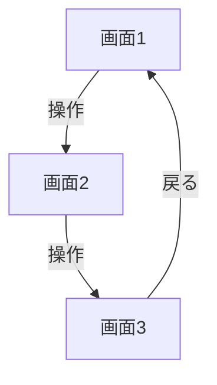
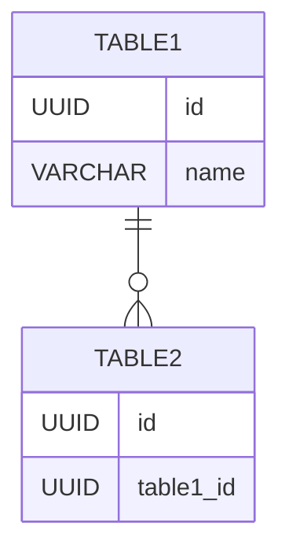

# [アプリ名] 設計書

**バージョン：** v1  
**作成日：** YYYY年MM月DD日  
**作成者：** [名前]

---

## F1：要件整理

### 背景・課題

- [現状の問題点・不便なこと]
- [なぜ今これを作ろうとしているか]

### ツールの目的

[このアプリが解決することを1〜2文で]

### 誰が使うか

- [ ] 自分だけ
- [ ] 限定公開（チーム・家族など）
- [ ] 不特定多数に公開

### v1 機能要件

1. [機能1]
   - [詳細]

2. [機能2]
   - [詳細]

### v2以降の候補（今回やらない）

- [将来追加する可能性がある機能]

### 技術的な制約・懸念点（仮）

- [使いたい技術・制約・コスト条件など]

> 詳細はF3（アーキテクチャ）で確定する。

---

## F2：画面・UI設計

### 2-0. 画面共通仕様

| 項目 | 内容 |
|-----|------|
| トンマナ | [例：ワイヤーフレーム的なシンプルさ／モダン・リッチ など] |
| メインカラー | [例：#XXXXXX] |
| アクセントカラー | [例：#XXXXXX] |
| エラーカラー | [例：#XXXXXX] |
| フォント | [例：システムフォント／Noto Sans JP など] |
| UIコンポーネントライブラリ | [例：Tailwind CSS / MUI / shadcn/ui など] |
| レスポンシブ方針 | [例：モバイルファースト、PCも対応] |

### 2-1. 画面一覧

| 画面名 | 役割 |
|-------|------|
| [画面1] | [役割] |
| [画面2] | [役割] |
| [画面3] | [役割] |

### 2-2. 画面フロー



> ※実際の画面フローはmermaidファイルを別途参照

### 2-3. 各画面の表示項目

#### [画面1名]

| 表示項目 | 説明 | 備考 |
|---------|------|------|
| [項目名] | [説明] | [表示ルール・フォーマットなど] |

#### [画面2名]

| 表示項目 | 説明 | 備考 |
|---------|------|------|
| [項目名] | [説明] | |

### 2-4. 画面シナリオ（CRUD）

| 操作 | 画面フロー | 確認ダイアログ | 操作後の遷移先 |
|-----|-----------|:---:|------------|
| **Create**（新規追加） | [遷移の流れ] | あり／なし | [遷移先] |
| **Read**（閲覧） | [遷移の流れ] | なし | [遷移先] |
| **Update**（編集） | [遷移の流れ] | あり／なし | [遷移先] |
| **Delete 1件** | [遷移の流れ] | あり | [遷移先] |
| **Delete 全件** | [遷移の流れ] | あり | [遷移先] |

### 2-5. セキュリティ要件

| 項目 | 内容 |
|-----|------|
| 認証の要否 | [不要 / 必要（方式：）] |
| 扱う個人情報 | [なし / あり（内容：）] |
| 公開範囲 | [デモ用：公開 / 本番用：ローカルのみ など] |
| データ保護方針 | [例：実データはローカル運用のみ] |

---

## F3：アーキテクチャ・技術スタック

### 技術スタック

| レイヤー | 選定 | 理由 |
|---------|------|------|
| フロントエンド | [例：React] | [理由] |
| データストア | [例：Supabase] | [理由] |
| ホスティング | [例：Cloudflare Pages] | [理由] |
| UIスタイル | [例：Tailwind CSS] | [理由] |
| その他 | [例：PapaParse] | [理由] |

### デプロイ構成

|  | **デモ用** | **本番用（自分用）** |
|--|-----------|-------------------|
| データ | デモデータ | 本物のデータ |
| 置き場 | [例：Cloudflare Pages で公開] | [例：ローカル] |
| 認証 | [例：不要] | [例：不要（自分だけ）] |
| コードベース | 共通 | 共通 |

### セキュリティ実装方針

- [認証方式または「なし」の判断理由]
- [データアクセス制御の方針]

### 運用方針

- **バックアップ：** [例：CSVエクスポート機能で手動バックアップ]
- **コスト管理：** [例：無料枠で運用]
- **障害時の対応：** [例：個人ツールのため対応不要]

---

## F4：データ設計

### テーブル一覧

| テーブル名 | 説明 |
|----------|------|
| [テーブル名] | [説明] |

### [テーブル名] カラム定義

#### システム項目

| カラム名 | データ型 | 必須 | 説明 |
|---------|---------|:---:|------|
| id | UUID | ○ | 主キー（自動生成） |
| createdAt | TIMESTAMP | ○ | 作成日時（自動） |
| updatedAt | TIMESTAMP | ○ | 更新日時（自動） |

#### [グループ名]

| カラム名 | データ型 | 必須 | 説明 | 備考 |
|---------|---------|:---:|------|------|
| [カラム名] | [型] | ○/- | [説明] | [備考] |

### コード定義・固定値

| 項目名 | 値 |
|-------|---|
| [例：ステータス] | [例：有料 / 無料 / 休止中] |

### バリデーションルール

| 項目 | ルール |
|-----|-------|
| [カラム名] | [ルール内容] |

### 削除方針

- [ ] 物理削除（シンプル）
- [ ] 論理削除（削除フラグ）

> 選択理由：[理由]

### CSV インポート・エクスポート仕様

#### ヘッダー定義

```
[カラム1],[カラム2],[カラム3],...
```

#### データ例

```csv
[カラム1],[カラム2],...
[データ例1]
[データ例2]
```

#### エラーハンドリング方針

- [例：ヘッダー不一致の場合はエラーメッセージを表示し、インポートを中断]

### ER図（複数テーブルがある場合）



---

## F5：実装前確認

### コンポーネント構成

```
src/
├── App.jsx
├── components/
│   ├── [Component1].jsx    # [役割]
│   ├── [Component2].jsx    # [役割]
│   └── [Component3].jsx    # [役割]
└── data/
    └── [初期データ等]
```

> ⚠️ コンポーネントは必ずトップレベル（モジュールスコープ）に定義すること。
> 他コンポーネントの内部に定義すると再マウントが発生しフォーカスバグの原因になる。

### 実装順序

1. [最初に実装するもの（例：スキーマ作成）]
2. [次に実装するもの]
3. [続き...]

### 命名規則

| 対象 | 規則 | 例 |
|-----|------|---|
| 変数・関数 | キャメルケース | `serviceName`, `renewalDate` |
| コンポーネント | パスカルケース | `SubscriptionDetail` |
| ファイル名（コンポーネント） | パスカルケース | `SubscriptionDetail.jsx` |

### 新規作成時のデフォルト値

| 項目 | デフォルト値 |
|-----|------------|
| [項目名] | [デフォルト値] |

### エラーハンドリング方針

| ケース | 対応 |
|-------|------|
| [例：必須項目が空で保存] | [例：保存を中断しエラー表示] |
| [例：通信エラー] | [例：エラーメッセージを表示] |

### 環境変数

| 変数名 | 用途 |
|-------|------|
| [例：VITE_SUPABASE_URL] | [Supabase接続URL] |
| [例：VITE_SUPABASE_ANON_KEY] | [Supabase匿名キー] |

> ⚠️ 環境変数はコードにハードコードしないこと。`.env` で管理し、`.gitignore` に追加する。

### デプロイ前チェック

- [ ] 👁 公開データに個人情報が含まれていないか確認した
- [ ] 環境変数が正しく設定されているか確認した
- [ ] デモ用データがダミーデータになっているか確認した

---

## F6：テスト

### テスト方針

| 種別 | 範囲 |
|-----|------|
| 🤖 自動確認 | [例：ビルド、バリデーション、計算ロジック] |
| 👁 手動確認 | [例：画面遷移、CRUD操作、レスポンシブ表示] |

**優先度の見方**
- 🔴 高：使えない・データが壊れる系
- 🟡 中：操作できるが表示がおかしい系
- 🟢 低：細かい表示のズレ

### 網羅性確認マトリクス

#### 画面 × 機能

| カテゴリ | 機能 | [画面1] | [画面2] | [画面3] |
|:---:|------|:---:|:---:|:---:|
| **表示** | 初期表示 | TC-XX | TC-XX | TC-XX |
| **データ操作** | Create | TC-XX | — | — |
| | Read | — | TC-XX | — |
| | Update | — | TC-XX | — |
| | Delete | — | TC-XX | TC-XX |
| **異常系** | 必須項目空で保存 | — | TC-XX | — |

#### CRUD対応表

| 操作 | 正常系 | キャンセル系 | 異常系 |
|-----|:---:|:---:|:---:|
| **Create**（新規追加） | TC-XX | TC-XX | TC-XX |
| **Read**（閲覧） | TC-XX | — | — |
| **Update**（編集） | TC-XX | TC-XX | TC-XX |
| **Delete 1件** | TC-XX | TC-XX | — |
| **Delete 全件** | TC-XX | TC-XX | — |

### テストケース一覧

> 🤖 = ツール・AIで自動確認 / 👁 = 人間が手動確認

---

#### TC-01 [テスト名] [優先度] [🤖/👁]

**前提条件**
- [テスト実施前の状態]

**手順**
1. [操作手順1]
2. [操作手順2]

**期待する結果**
- [期待する動作]

**実際の結果**
>

---

#### TC-02 [テスト名] [優先度] [🤖/👁]

**前提条件**
- [テスト実施前の状態]

**手順**
1. [操作手順1]

**期待する結果**
- [期待する動作]

**実際の結果**
>

---

### バグ報告フォーマット（Claude Codeへの渡し方）

```
## バグ報告

**テストID：** TC-XX
**テスト名：** [テスト名]
**再現手順：**
1. [手順1]
2. [手順2]

**期待する結果：** [期待する動作]
**実際の結果：** [実際の動作・エラーメッセージ]

**環境：** PC Chrome / iPhone Safari / etc.
```

---

*このテンプレートは「サブスク迷子防止ツール」開発プロジェクト（2026年2月）の実体験をベースに作成。*
